| Nama  | Oktovan Agung Shailendra|
|-------|-------------------------|
|NIM    |: 312010131              |
|Kelas  |: TI.20.A.1              |

---
 # Praktikum 9 PHP Modular

 ## Langkah - Langkah Praktikum

 - Buat folder baru dengan nama **lab9_php_modular** pada docroot webserver (htdocs)
 

- Buat file baru dengan nama **header.php**
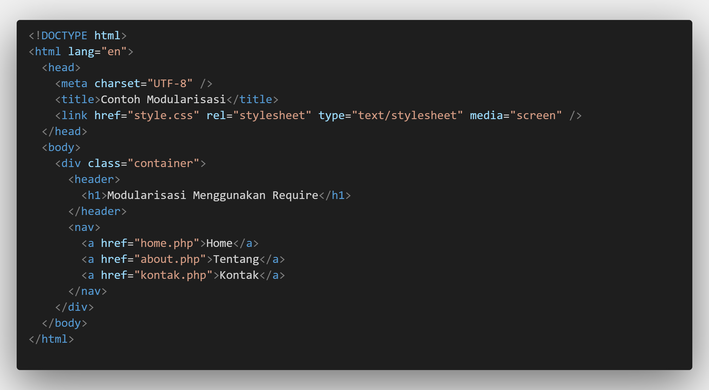

- Buat file baru dengan nama **footer.php**
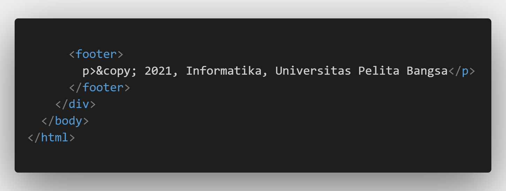

- Buat file baru dengan nama **home.php**
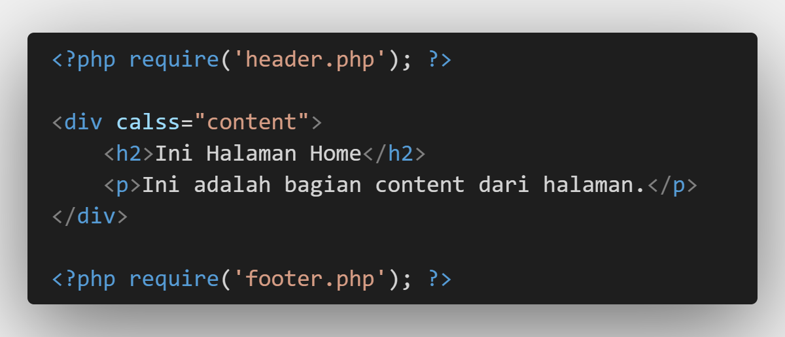

- Buat file barudengan nama **about.php**

- Output dari semua code diatas

# Pertanyaan & Tugas
Implementasikan konsep modularisasi pada kode program **praktikum 8** tentang database, sehingga setiap halamannya memiliki template tampilan yag sama.

## Berikut struktur direktori yang saya buat.
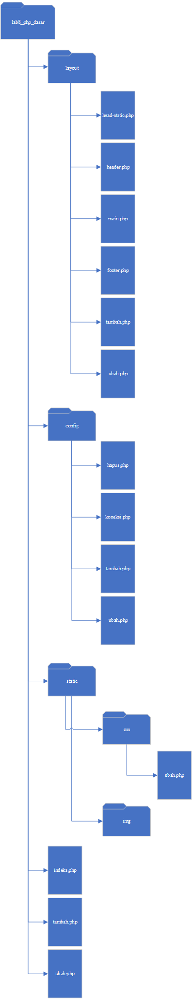

## Layouts
Untik tampilan utama pada website dan dibagi menjadi beberapa file.
- head_static.php
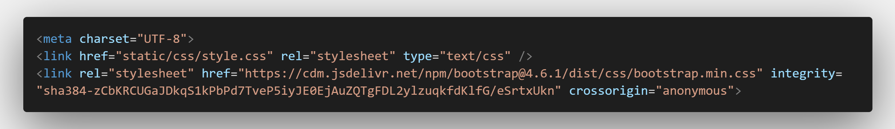

- header.php
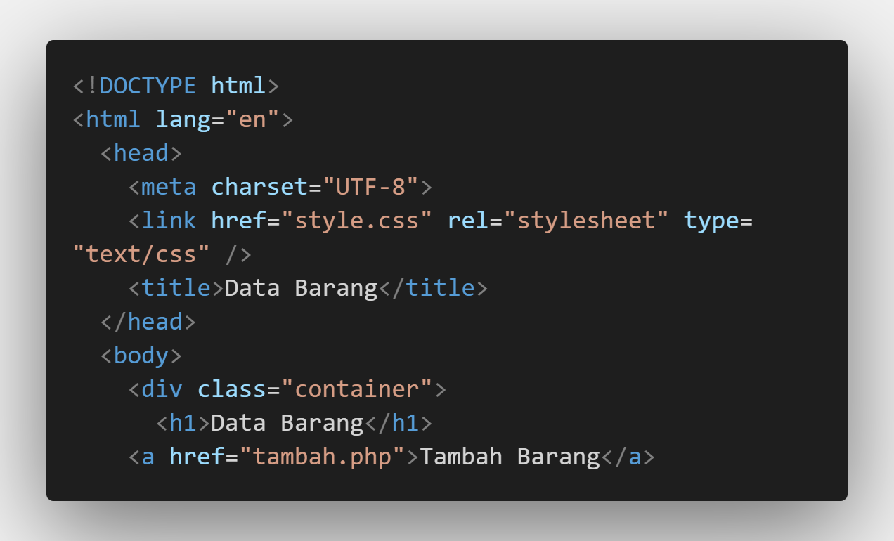

- mian.php

- footer.php
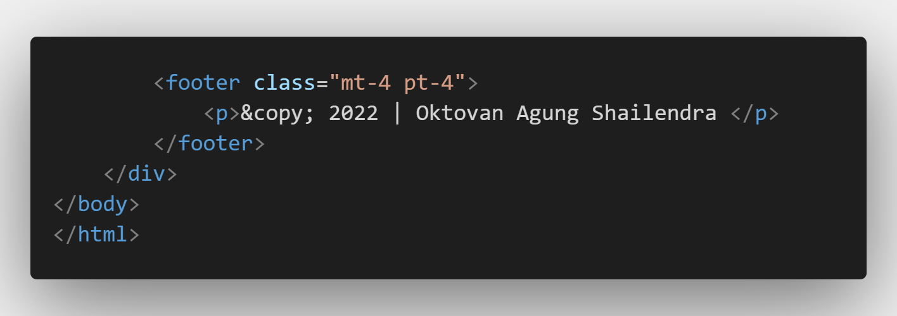

## Config
Dalam file ini menyimpan file php yang nanti akan dipanggil

- koneksi.php
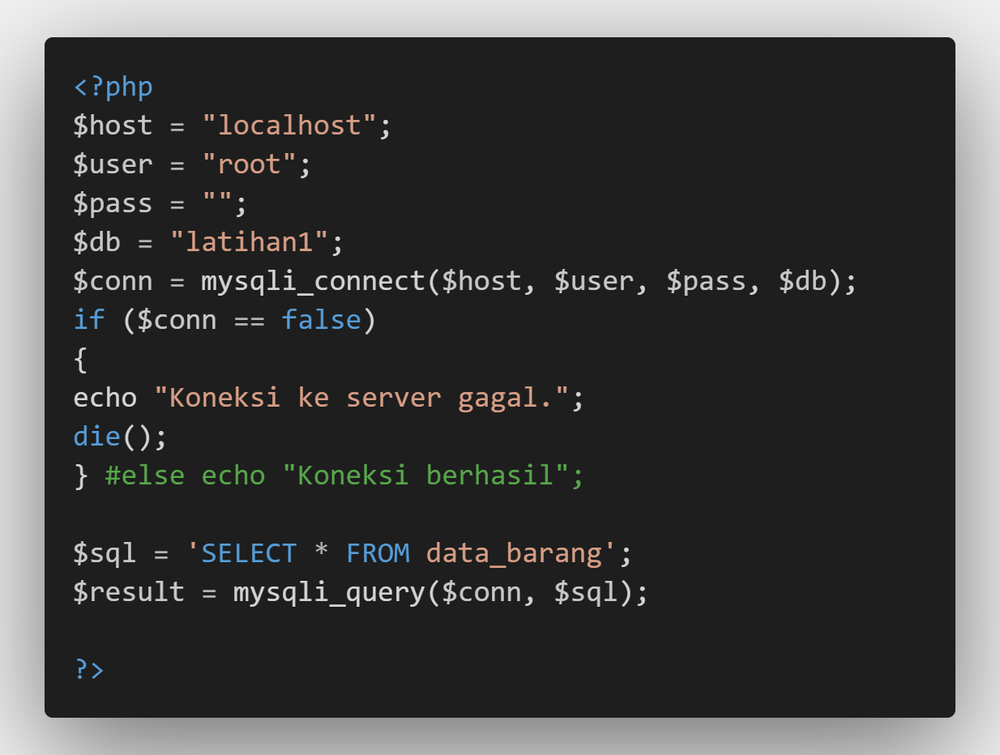

- tambah.php
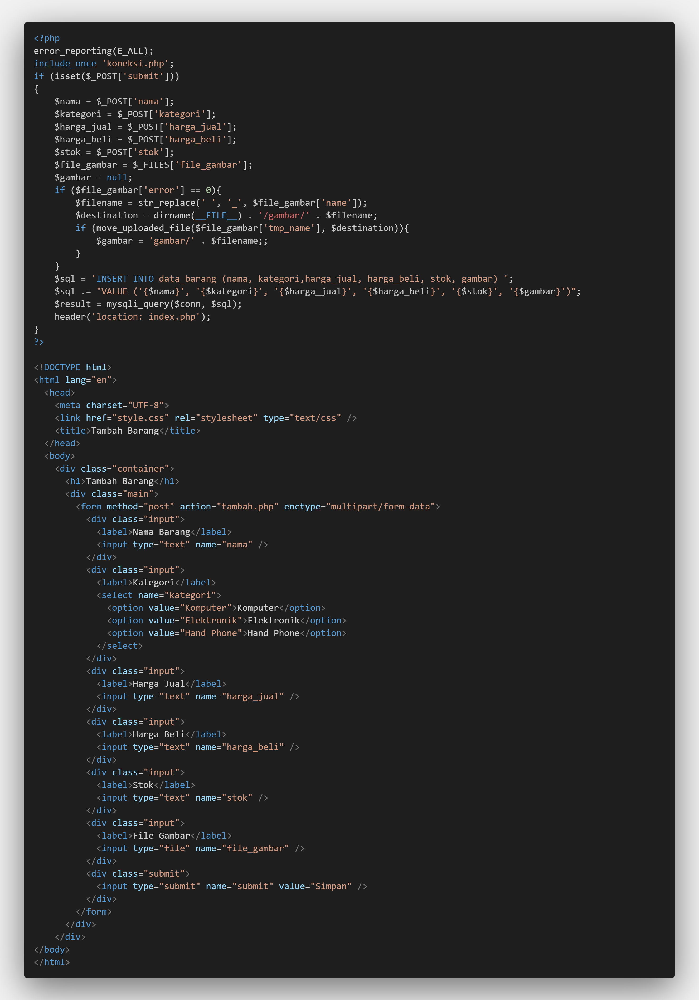

- ubah.php
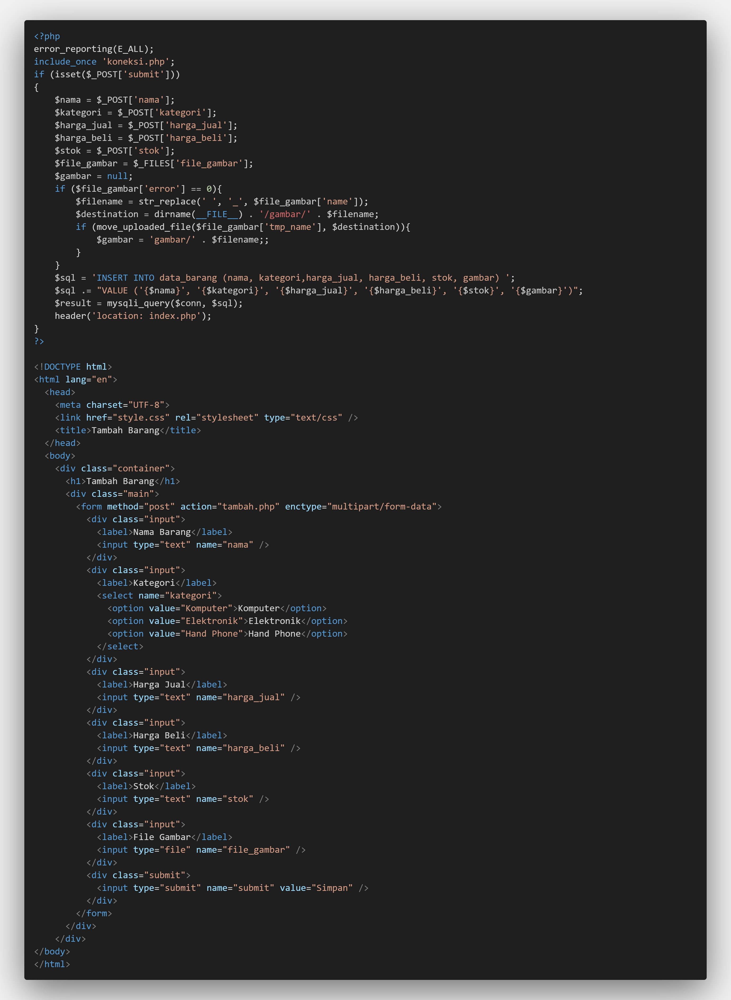

- hapus.php
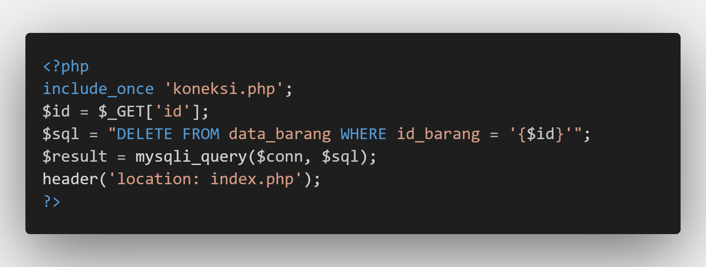

## Static
Folder ini untukmenyimpan file yang diperlukan seperti css, js, dangambar.

- style.css
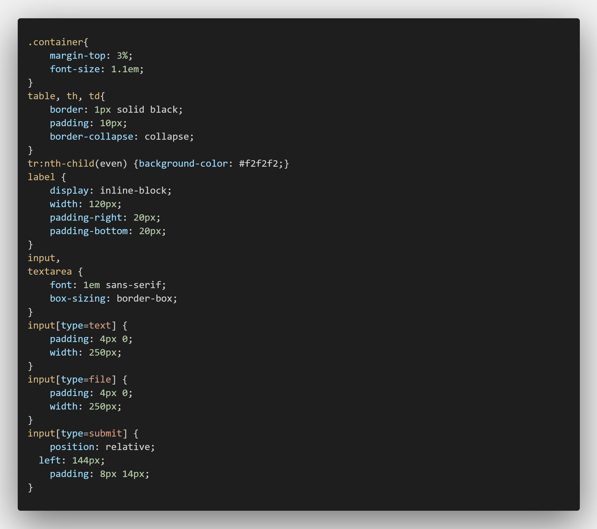

## index.php, tambah.php, ubah.php
File utama untuk wadah memanggil sub-file di beberapa direktori

- index.php
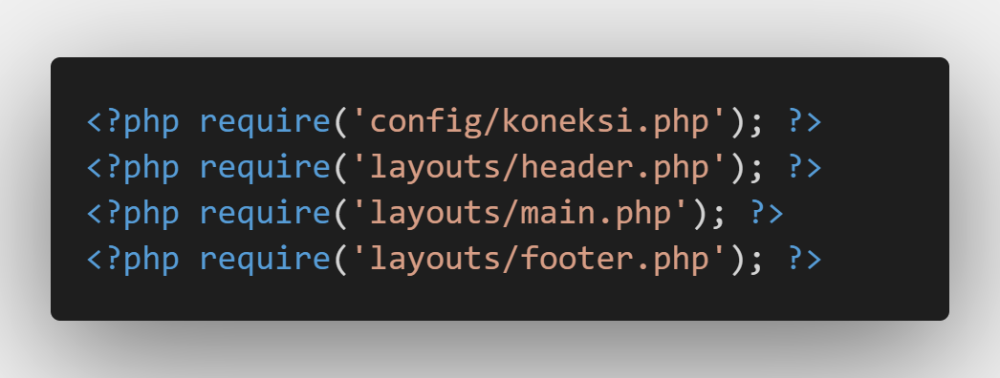

- tambah.php
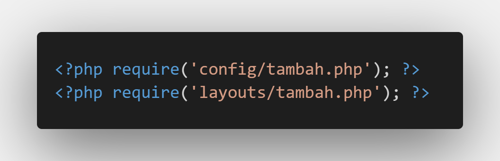

- ubah.png
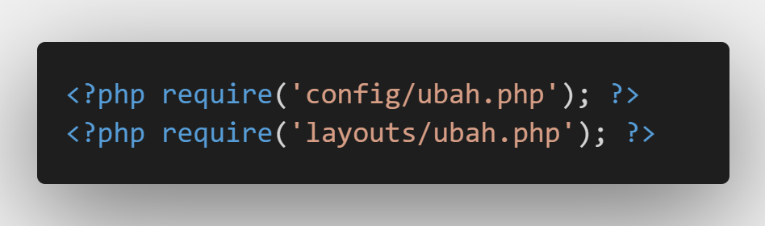

## OUTPUT
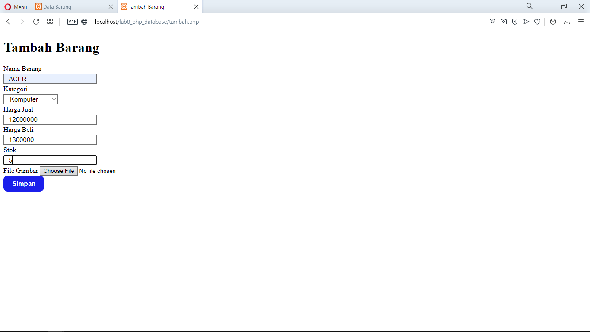

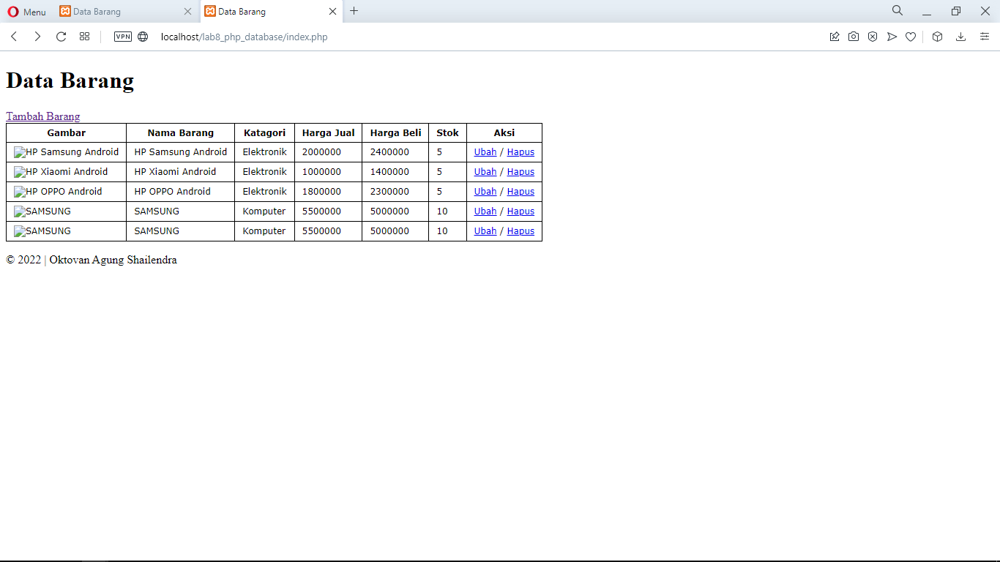

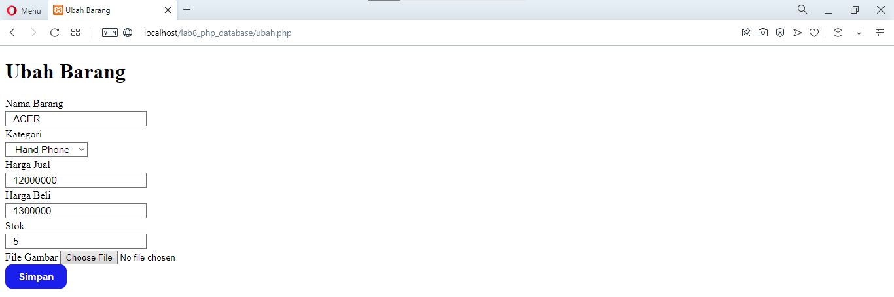
