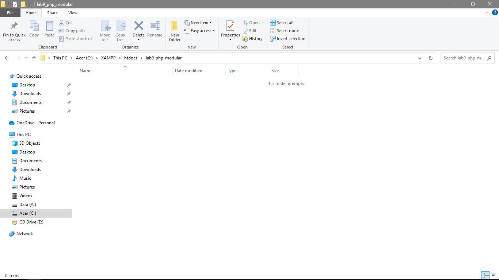
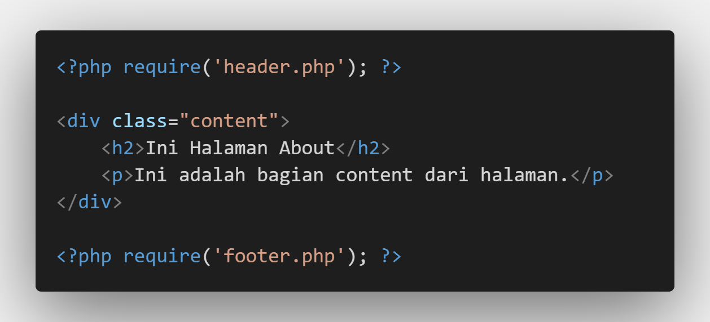
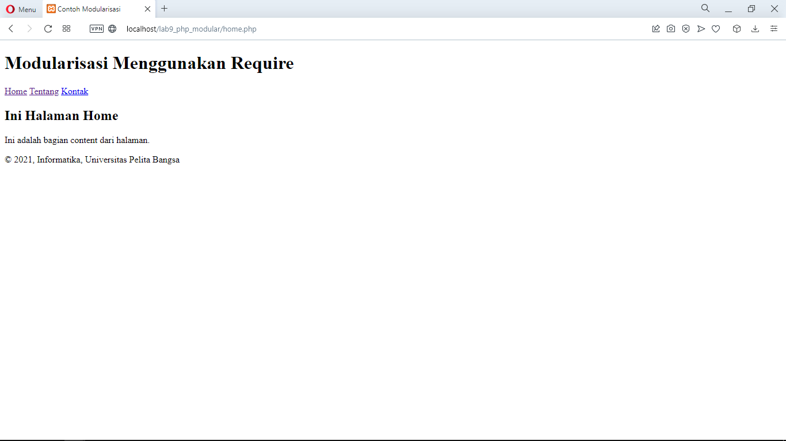

| Nama  | Oktovan Agung Shailendra|
|-------|-------------------------|
|NIM    |: 312010131              |
|Kelas  |: TI.20.A.1              |

---
 # Praktikum 9 PHP Modular

 ## Langkah - Langkah Praktikum

 - Buat folder baru dengan nama **lab9_php_modular** pada docroot webserver (htdocs)
 

- Buat file baru dengan nama **header.php**

- Buat file baru dengan nama **footer.php**

- Buat file baru dengan nama **home.php**

- Buat file barudengan nama **about.php**

- Output dari semua code diatas

## Pertanyaan & Tugas
Implementasikan konsep modularisasi pada kode program **praktikum 8** tentang database, sehingga setiap halamannya memiliki template tampilan yag sama.

Berikut struktur direktori yang saya buat.